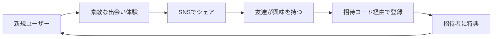

# marketing.md - Tempoマーケティング戦略書

## 🎯 マーケティング目標

### 短期目標（3ヶ月）
- **MAU**: 50,000人
- **DAU/MAU**: 25%以上
- **D7リテンション**: 40%以上
- **NPS**: 60以上

### 中期目標（6ヶ月）
- **MAU**: 200,000人
- **月間収益**: 100万円
- **オーガニック率**: 60%以上
- **メディア掲載**: 50件以上

### 長期目標（1年）
- **MAU**: 500,000人
- **月間収益**: 500万円
- **海外展開**: アジア3カ国
- **ブランド認知度**: 20%（18-25歳）

---

## 🚀 ローンチ戦略

### Phase 1: ステルスローンチ（Week 1-2）
**東京限定・招待制**

#### ターゲット
- 都内大学生 1,000人
- 20-25歳の若手社会人
- インフルエンサーの知人

#### 戦術
```
1. シードユーザー獲得
   - インフルエンサー（AIKO）の個人的な招待
   - 限定100名の先行アクセス
   - 招待コード制（希少性演出）

2. 口コミ基盤構築
   - ユーザーに3つの招待枠付与
   - 招待成功で特別バッジ付与
   - 初期ユーザー限定の特典

3. フィードバック収集
   - 毎日のアンケート（回答率目標: 50%）
   - ユーザーインタビュー（週10人）
   - Discord コミュニティ開設
```

### Phase 2: 限定公開（Week 3-4）
**関東圏拡大**

#### 拡大戦略
```
1. 大学キャンパス攻略
   - 早稲田、慶應、明治、青学
   - サークル代表へのアプローチ
   - 学園祭でのプロモーション

2. オフラインイベント
   - 「暇人カフェ会」開催（渋谷、新宿、池袋）
   - 参加費無料、定員30名
   - 参加者限定で友達招待権

3. SNS露出開始
   - TikTok でティザー投稿
   - Instagram ストーリーズ広告（限定的）
   - Twitter での話題化狙い
```

### Phase 3: 一般公開（Month 2）
**全国展開**

#### 本格展開
```
1. プレスリリース
   - 「数字のないSNS」として差別化
   - Z世代のメンタルヘルス問題提起
   - 創業ストーリーの発信

2. インフルエンサーマーケティング
   - マイクロインフルエンサー50名
   - 「#暇なう」キャンペーン
   - 体験レポート投稿

3. 広告投入
   - TikTok 広告（メイン）
   - Instagram 広告（サブ）
   - YouTube 広告（認知拡大）
```

---

## 📱 SNSマーケティング戦略

### TikTok戦略（最重要）

#### コンテンツカレンダー
```
月曜: 「今週の奇跡の出会い」実話
火曜: 暇つぶしアイデア紹介
水曜: ユーザーインタビュー
木曜: 「#暇チャレンジ」企画
金曜: 週末イベント告知
土曜: 感動ストーリー
日曜: 次週予告
```

#### バイラルコンテンツ企画

##### 1. 「暇ダンス」
```
- オリジナル楽曲制作
- 簡単な振り付け（15秒）
- #暇ダンス で拡散
- 参加者に特別バッジ付与
```

##### 2. 「24時間チャレンジ」
```
- 24時間で何人と繋がれるか
- リアルタイム配信
- 視聴者参加型
- 優勝者にプレミアム1年分
```

##### 3. 「運命の出会いストーリー」
```
- 実際のユーザーストーリー
- 感動的な出会いを再現
- シリーズ化（週1投稿）
- ユーザー投稿も募集
```

### Instagram戦略

#### フィード投稿
- ユーザーの声（testimonial）
- アプリの使い方ガイド
- イベント告知
- ブランドメッセージ

#### ストーリーズ
- 日替わりアンケート
- ユーザー投稿のリポスト
- 裏側コンテンツ
- Q&A セッション

#### リール
- TikTok コンテンツの転用
- How-to 動画
- ユーザー体験談

### Twitter/X戦略

#### 投稿方針
```
- リアルタイムの話題に乗る
- ユーザーツイートへの積極的リプライ
- 「暇」に関する共感ツイート
- アップデート情報
```

#### ハッシュタグ戦略
- #暇なう
- #24時間フレンド
- #数字のないSNS
- #今この瞬間
- #Tempoつながり

---

## 🎪 イベントマーケティング

### オンラインイベント

#### 1. 「深夜の暇人会」（毎週金曜 23:00）
```
形式: Zoom/Discord
定員: 100名
内容:
- アイスブレイク
- グループトーク
- ゲーム大会
- 次回予告

KPI:
- 参加率: 80%
- リピート率: 60%
- 友達招待率: 30%
```

#### 2. 「朝活マッチング」（毎週月曜 7:00）
```
形式: アプリ内特別マッチング
内容:
- 朝限定の特別マッチング
- 朝活バッジ付与
- 1週間の目標共有
```

### オフラインイベント

#### 1. 「Tempoカフェ」（月1回）
```
場所: 渋谷、新宿、池袋のカフェ
定員: 30名
参加費: 500円（ドリンク付き）

内容:
- リアルマッチング
- ボードゲーム
- フリートーク
- アプリ体験会

収益:
30名 × 500円 = 15,000円
コスト: 10,000円
利益: 5,000円/回
```

#### 2. 「地方都市ツアー」
```
都市: 大阪、名古屋、福岡、札幌
頻度: 月1都市
規模: 50-100名

効果:
- 地方ユーザー獲得
- メディア露出
- 口コミ拡散
```

---

## 💰 収益化戦略

### Phase 1: ユーザー獲得期（Month 1-3）
**収益目標: 0円（投資期間）**

```
方針:
- 完全無料で提供
- ユーザー体験の最適化
- データ収集とPMF達成
```

### Phase 2: 収益化開始（Month 4-6）
**収益目標: 月30万円**

#### イベント収益
```
オンラインイベント:
- 参加費: 500円
- 月4回 × 100名 × 500円 = 20万円

オフラインイベント:
- 参加費: 1,000円
- 月2回 × 50名 × 1,000円 = 10万円

合計: 30万円/月
```

### Phase 3: 本格収益化（Month 7-12）
**収益目標: 月100万円**

#### 収益源配分
```
1. イベント（40%）: 40万円
   - 規模拡大
   - 企業コラボ

2. プレミアム機能（30%）: 30万円
   - 月額500円
   - 転換率2%
   - 3,000人 × 500円 = 150万円
   - 実際は30万円を想定

3. 企業タイアップ（20%）: 20万円
   - 場所連動キャンペーン
   - ブランドコラボ

4. バーチャルギフト（10%）: 10万円
   - 応援ギフト販売
```

---

## 📊 グロースハック戦略

### バイラルループ設計



### K-Factor最適化

```
K = i × c
i (招待数) = 平均招待送信数
c (転換率) = 招待からの登録率

目標: K > 1.2

現状:
i = 2.5（1人あたり2.5人招待）
c = 0.3（30%が登録）
K = 0.75

改善施策:
- 招待インセンティブ強化 → i を 3.5 へ
- オンボーディング改善 → c を 0.4 へ
- 結果: K = 1.4（バイラル成長）
```

### リテンション改善

#### Day 1 リテンション（目標: 70%）
```
施策:
- ウェルカムボーナス
- 初回マッチング保証
- チュートリアル完走でバッジ
```

#### Day 7 リテンション（目標: 40%）
```
施策:
- 7日連続ログインボーナス
- 週間サマリー通知
- 新機能の段階的解放
```

#### Day 30 リテンション（目標: 20%）
```
施策:
- 月間アチーブメント
- 限定イベント招待
- パーソナライズ強化
```

---

## 🎯 ペルソナ別マーケティング

### ペルソナA: 地方大学生「りさ」

#### アプローチ
```
チャネル:
- TikTok（メイン）
- 大学内口コミ
- 学生団体連携

メッセージ:
「地方でも都会でも、みんな同じ。
 普通の自分で、素敵な出会いを。」

クリエイティブ:
- 地方 vs 都会の対比
- 「普通」の価値訴求
- 共感ストーリー
```

### ペルソナB: 若手社会人「みお」

#### アプローチ
```
チャネル:
- Instagram（メイン）
- Twitter
- 通勤時間広告

メッセージ:
「仕事だけじゃない、
 本当の自分でつながる場所。」

クリエイティブ:
- アフター5の過ごし方
- ストレス解消法
- 新しい友達作り
```

---

## 📈 KPI管理

### 週次トラッキング指標

```
獲得系:
- 新規インストール数
- 登録完了率
- 招待送信数
- 招待転換率

エンゲージメント系:
- DAU/MAU
- 平均セッション時間
- マッチング数
- メッセージ送信数

収益系:
- イベント参加者数
- 課金転換率
- ARPU
- LTV
```

### 月次レビュー項目

```
1. ユーザー獲得
   - CAC（顧客獲得コスト）
   - オーガニック率
   - チャネル別効率

2. プロダクト
   - PMFスコア
   - NPS
   - 機能別利用率

3. 収益
   - MRR（月間経常収益）
   - 成長率
   - ユニットエコノミクス
```

---

## 🌟 PR戦略

### メディアアプローチ

#### Tier 1 メディア
```
- TechCrunch Japan
- BRIDGE
- Forbes Japan
- 日経新聞

切り口:
「Z世代が作る、数字のないSNS」
「インフルエンサー疲れに対する解」
```

#### Tier 2 メディア
```
- ITmedia
- CNET Japan
- ASCII
- Engadget

切り口:
「24時間で消える友情の価値」
「暇の再定義」
```

#### Tier 3 メディア
```
- ライフハッカー
- ギズモード
- AppBank
- アプリ系メディア

切り口:
「新しい友達の作り方」
「孤独解消アプリ」
```

### プレスリリース計画

```
Month 1: ローンチリリース
Month 2: ユーザー数達成リリース
Month 3: 機能追加リリース
Month 4: 資金調達リリース
Month 6: 海外展開リリース
```

---

## 🎨 クリエイティブ戦略

### ブランドメッセージ

#### メインコピー
```
「今この瞬間を、誰かと。」
```

#### サブコピー
```
- 「数字じゃない、気持ちでつながる」
- 「24時間の友達、一生の思い出」
- 「暇も立派な個性です」
- 「フォロワー0人から始まる本当の関係」
```

### ビジュアルアイデンティティ

```
カラー:
- メイン: Tempo Blue (#4A90E2)
- サブ: Warm Orange (#FF6B35)
- 背景: Soft Gray (#F5F5F5)

トーン:
- 温かい
- 親しみやすい
- カジュアル
- ポジティブ

禁止事項:
- 数字の強調
- 競争的な表現
- プレッシャーを感じる表現
- 冷たい印象
```

---

## 📱 アプリストア最適化（ASO）

### キーワード戦略

#### 主要キーワード
```
1. 暇つぶし
2. 友達作り
3. マッチング
4. チャット
5. 新しいSNS
```

#### ロングテール
```
- 暇な時間 アプリ
- 友達 探し
- 気軽に話せる
- 24時間 チャット
- 数字のないSNS
```

### ストア掲載情報

#### アプリ名
```
Tempo - 今この瞬間を誰かと
```

#### 短い説明
```
24時間限定でつながる新感覚SNS。
フォロワー数もいいね数も表示なし。
今この瞬間を共有しよう。
```

#### 詳細説明
```
【Tempoとは】
今この瞬間の「気分」や「状態」を共有して、
同じテンポの人と24時間限定でつながる
まったく新しいSNSです。

【特徴】
✓ 数字（フォロワー・いいね）を表示しない
✓ 24時間で自動的にリセット（延長可能）
✓ 今の気分や活動でマッチング
✓ プレッシャーのない優しい設計

【こんな人におすすめ】
- SNS疲れを感じている
- 気軽に話せる相手が欲しい
- 新しい出会いを求めている
- 暇な時間を楽しく過ごしたい
```

---

## 🔄 PDCAサイクル

### 週次サイクル
```
月曜: KPI確認、課題抽出
火曜: 施策立案
水曜: A/Bテスト設計
木曜: 実装・投入
金曜: 初期結果確認
土日: データ分析
```

### 月次サイクル
```
第1週: 前月振り返り
第2週: 施策実行
第3週: 中間レビュー
第4週: 次月計画
```

---

## 📅 12ヶ月ロードマップ

```
Month 1-3: Foundation
- ローンチ
- PMF達成
- 5万MAU

Month 4-6: Growth
- 収益化開始
- 20万MAU
- メディア露出

Month 7-9: Expansion
- 機能拡張
- 35万MAU
- 地方展開

Month 10-12: Scale
- 海外準備
- 50万MAU
- Series A準備
```

---

**このマーケティング戦略は市場の反応を見ながら柔軟に調整します。**
**週次でKPIをレビューし、必要に応じて戦略を更新してください。**

**作成日**: 2025/01/XX
**最終更新**: 2025/01/XX
**担当**: マーケティングチーム
